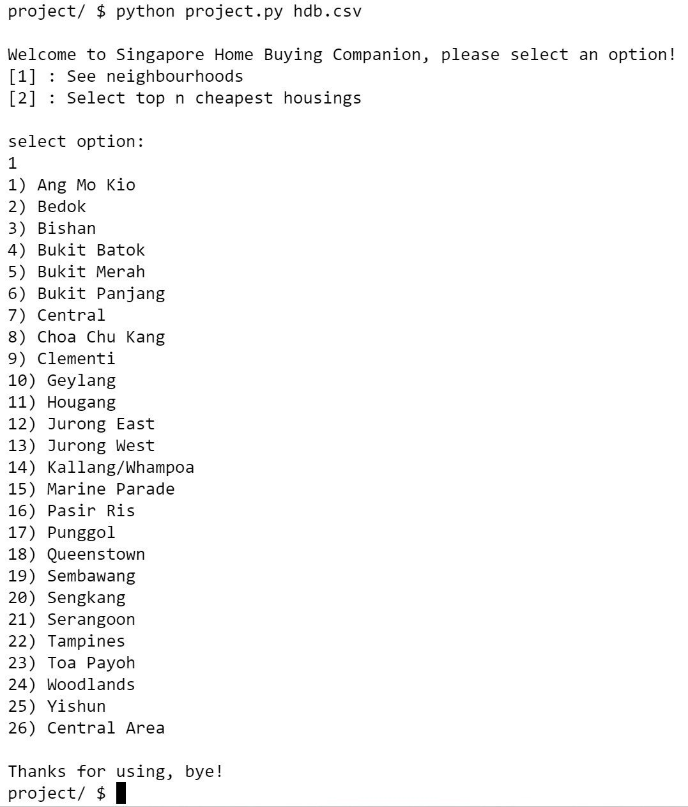
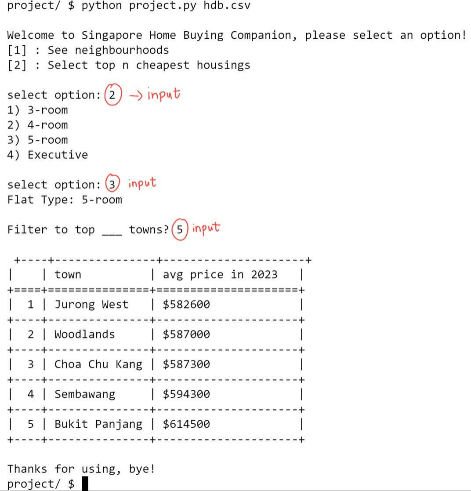

# Singapore Home Buying Companion
## Video Demo: submit50 cs50/problems/2022/python/project

## Description:
Are you looking for a housing in Singapore, and have a very tight budget? Look no further than our Singapore Home Buying Companion. Using official data on recent housing prices in Singapore, you can look for the town areas that provide the cheapest housing for you, as well as the average prices of the housing in that area.

My project is an interactive command-line tool designed to assist users in exploring housing data in Singapore. It also provides the feature of viewing neighborhoods, so that you can do your research at those towns.

## Project Structure:
- project.py : contains the main functionality of the program, including menu creation, data processing, and user interaction.
- test_project.py : Includes unit tests for testing the functionality of the project.py file.
- README.md : this file, which provides overview of my program
- hdb.csv (csv file of housing data in Singapore)
- mock.csv : used for unit testing

## Libraries Used:
- **sys**: Provides access to some variables used or maintained by the Python interpreter and to functions that interact strongly with the interpreter, allowing me to carry out functions using the `hdb.csv` that I have inputted in my command line. [(Read More)](https://docs.python.org/3/library/sys.html)
- **csv**: Used to read my csv file. [(Read More)](https://docs.python.org/3/library/csv.html)
- **tabulate**: The tabulate library is used to generate formatted tables in the output for better readability. [(Read More)](https://pypi.org/project/tabulate/)

## Installation:
To install the required libraries, run the following command:
`pip install -r requirements.txt`

## Usage:
1) run python project.py hdb.csv
   -The user is presented with a menu to select an option.
        Option 1 allows the user to see neighborhoods.
        Option 2 allows the user to select the top N towns that has the cheapest housings in 2023.

2) Option 1 will lead to Functionality 2, Option 2 will lead to Functionality 3

3) Functionality 3 will require user to input the flat-type that they desire, followed by the top N town areas that has the cheapest housings.

4) User input may be wrong, and the wrong kind of input will reprompt users with error message. For example, if they input an option that is not provided, or they input wrong arguments in the command line.

## Functionality:
1) ## `create_menu(data)`:
Displays the menu and handles user input.

2) ## `see_neighbourhoods(data)`:
Reads the data from the CSV file and displays unique neighborhoods.

3) ## `n_cheapest_housings_2023(data)`:
Reads the data from the CSV file, filters by the year 2023, calculates the top N (chosen by user) cheapest housings for the flat type (chosen by user), and displays the result. Ties are resolved using the Standard Competition Ranking (1224). Results are displayed neatly in a grid table using the tabulate library.

#### Author: [Lin Myat]

#### Motivation for this project:
I am interested in data analytics. Hence I created a program that allows me to clean data(`csv`), filtering data to specific flat-types and year 2023, and do data visualisation(`tabulate`), presenting them in a neat manner. I present the cheap town areas in a grid table format, that is appealing to users and make it easier for them to read and understand.

*this has been cs50p, thank you for using my program:)*
